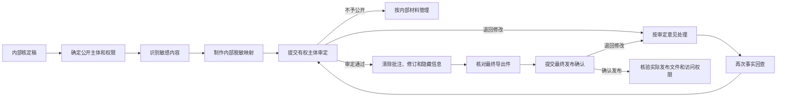

<div align="center">
  <h1>会议纪要人工写作手册</h1>
  <p><strong>从会前准备、现场记录到事实核验与规范成稿</strong></p>
  <p>面向机关办公室、会议秘书、记录人员、文字工作者和纪要审核人员</p>
</div>

---

> [!IMPORTANT]
> 会议纪要写作的首要任务不是把文字写得“像公文”，而是准确记载会议主要情况和议定事项。任何结构、句式和润色，都不能替代真实会议结论。

本手册把会议事实控制和证据回查方法，转化为人类写作者可以直接执行的工作步骤。它既讲“怎样写”，也讲“怎样记、怎样核、怎样避免写错”。

文中贯穿案例均为虚构，仅用于演示方法；真实公开样例仅用于观察体例，不作为任何具体会议的事实来源。

## 使用导航

| 你的任务 | 建议先读 |
| --- | --- |
| 第一次起草会议纪要 | 第一、二、八、十一章 |
| 准备参加会议并负责记录 | 第三章和[一页速查卡](会议纪要写作速查卡.md) |
| 把录音转写稿整理成纪要 | 第四至八章、第十一章和第十三章 |
| 修改一篇套话较多的纪要 | 第九章 |
| 审查正式印发稿或公开稿 | 第十、十二、十三章 |
| 学习政府网站公开纪要 | 第十四章 |

**快速跳转**

[文种边界](#第一章-先判断是不是纪要)　·　[完整流程](#第二章-把写作变成一条可核验的流程)　·　[定制记录提示卡](#第三章-会前先做定制记录提示卡)　·　[事实台账](#第五章-先建事实台账再写正文)　·　[结论强度](#第六章-准确把握结论强度)　·　[行动链](#第七章-把任务写成完整行动链)　·　[完整案例](#第十一章-贯穿案例从杂乱记录到纪要净稿)　·　[审查清单](#第十三章-五轮审查法)

### 全书目录

| 基础与记录 | 起草与审查 |
| --- | --- |
| [第一章　文种判断](#第一章-先判断是不是纪要) | [第八章　标题、开头和正文](#第八章-搭建标题开头和正文) |
| [第二章　完整工作流程](#第二章-把写作变成一条可核验的流程) | [第九章　语言自然化](#第九章-让语言自然简明平实) |
| [第三章　定制记录提示卡](#第三章-会前先做定制记录提示卡) | [第十章　内部稿与公开稿](#第十章-内部稿正式稿和公开稿要分开) |
| [第四章　整理杂乱记录](#第四章-从杂乱记录中恢复会议事实) | [第十一章　完整贯穿案例](#第十一章-贯穿案例从杂乱记录到纪要净稿) |
| [第五章　事实台账](#第五章-先建事实台账再写正文) | [第十二章　高频错误](#第十二章-十二类高频错误) |
| [第六章　结论强度](#第六章-准确把握结论强度) | [第十三章　五轮审查](#第十三章-五轮审查法) |
| [第七章　责任行动链](#第七章-把任务写成完整行动链) | [第十四章　真实样例学习](#第十四章-怎样学习真实公开样例) |

---

## 第一章 先判断是不是纪要

### 1.1 纪要的法定定位

《党政机关公文处理工作条例》明确，纪要用于记载会议主要情况和议定事项。公文起草还应做到内容简洁、主题突出、结构严谨、表述准确、文字精练，正式版式按照现行《党政机关公文格式》执行。

- [《党政机关公文处理工作条例》公开页面](https://www.miit.gov.cn/xwdt/szyw/art/2020/art_6afb8ee6d07540dcacccbeb47dbc0fd4.html)
- [GB/T 9704—2012《党政机关公文格式》状态页面](https://openstd.samr.gov.cn/bzgk/std/newGbInfo?hcno=F3CC9BEF482524C895FDA7A08BB4A70E)

可以把纪要理解为两个部分：

```text
会议主要情况 + 已经形成的议定事项
```

前者回答“何时、由谁主持、研究了什么”，后者回答“最后形成了什么意见、由谁做什么、接下来走什么程序”。

### 1.2 纪要不是会议记录的精简版

| 文种或材料 | 主要目的 | 写作重心 | 与纪要的区别 |
| --- | --- | --- | --- |
| 会议记录 | 保存会议过程和发言原貌 | 谁说了什么、讨论如何展开 | 纪要不按发言顺序复写全过程 |
| 纪要 | 记载会议主要情况和议定事项 | 最终结论、任务分工、办理程序 | 必须区分讨论和结论 |
| 通知 | 部署执行或告知事项 | 谁执行、执行什么 | 纪要不能替代另行制发的通知 |
| 请示 | 请求上级指示或批准 | 请求事项和理由 | 纪要不是向上级申请批准 |
| 报告 | 汇报工作、反映情况 | 情况、问题、工作进展 | 纪要不是工作汇报 |
| 决定 | 对重要事项作出决策部署 | 决策内容和执行要求 | 纪要不能替代依法应当作出的决定 |

### 1.3 三个起草门槛

是否形成、印发纪要，应先依本机关制度和会议组织安排确定。下列三项只用于判断是否具备起草的证据基础，不构成发文、印发或公开授权。

只有同时能够回答下列问题，才适合形成纪要：

1. **会议确已召开吗？**
2. **材料能够证明会议研究了哪些议题吗？**
3. **至少有部分事项形成了可确认的会议结论吗？**

> [!CAUTION]
> 会议通知只能证明计划开会，议程只能证明计划研究什么，汇报材料只能证明提交了什么方案。它们不能单独证明会议已经召开，更不能证明会议已经同意方案。

### 1.4 不宜直接写成纪要的情形

- 会议尚未召开，只有议程和汇报材料。
- 会议进行了讨论，但没有形成最终归纳。
- 需要上级机关批准，实际应当写请示。
- 需要向下部署普遍执行，实际还应另行制发通知。
- 涉及许可、处罚、采购、招投标、资金拨付等法定事项，企图只用纪要替代正式程序文书。
- 公开边界不清，材料中含个人隐私、商业秘密、案件信息或未公开政策。

**一句话判断法**

> 如果正文主要回答“会上最后定了什么”，通常接近纪要；如果主要回答“请上级批准什么”“要求下级执行什么”或“某人发言说了什么”，应重新判断文种。

---

## 第二章 把写作变成一条可核验的流程

### 2.1 完整工作链


### 2.2 五个阶段及其产物

| 阶段 | 核心问题 | 建议产物 |
| --- | --- | --- |
| 会前 | 本次会议最需要形成什么结果 | 定制记录提示卡 |
| 会中 | 主持人最后归纳了什么 | 结论原话和行动链记录 |
| 会后整理 | 哪些是事实、讨论、结论和未决事项 | 事实台账、候选核定清单 |
| 起草 | 如何按议题呈现最终状态和责任 | 纪要初稿 |
| 审查 | 是否写错、漏写、升级或泄露 | 纪要净稿、独立核验附注 |

### 2.3 三条不可颠倒的顺序

1. **先核事实，后调结构。**
2. **先锁定结论，后润色语言。**
3. **先确定公开边界，后制作公开稿。**

语言通顺不等于事实准确，格式整齐不等于会议真的形成了对应层次。

---

## 第三章 会前先做定制记录提示卡

### 3.1 为什么要在会前准备

许多纪要问题不是写作能力不足，而是会中漏记了关键内容：

- 主持人说了“原则同意”，记录人员只记成“同意”。
- 记了责任单位，却没有记具体动作。
- 记了“抓紧办理”，却没有确认是否存在明确日期。
- 记了各方讨论，却漏掉最后“暂缓研究”的结论。
- 记了内部敏感细节，却没有确认公开范围。

会后再追问，往往需要重新听录音、找参会人员核实，成本远高于会前多准备一页提示卡。

### 3.2 定制，不是套一张万能表

定制提示卡应先读取：

- 会议名称、类型、时间和主持人。
- 议题顺序、汇报单位和材料版本。
- 每个议题拟请会议明确的问题及可能的结论类型，不预设实际结论。
- 是否涉及资金、审批、执法、人事、项目或跨部门分工。
- 纪要用于内部办理、正式印发还是公开发布。

然后根据议题类型改变重点：

| 议题类型 | 最需要记录的内容 |
| --- | --- |
| 听取汇报 | 是否认可汇报、主要判断、改进要求、责任和时限 |
| 审议文件 | 文件版本、结论强度、修改内容、发文或报批程序 |
| 协调事项 | 争议焦点、最终处理原则、各单位动作、反馈机制 |
| 部署落实 | 任务对象、动作、牵头配合、时限、验收标准 |
| 风险处置 | 已确认事实、尚待核实线索、处置权限和公开边界 |

### 3.3 每个议题的八个核心栏

| 栏目 | 现场必须抓住什么 |
| --- | --- |
| 事项依据 | 文件全称、版本、汇报单位、关键数据口径 |
| 最终归纳 | 主持人或有权归纳者的最后意见 |
| 结论原话 | 同意、原则同意、报批、暂缓、再议等 |
| 牵头配合 | 谁牵头、谁配合，不能只记“相关部门” |
| 具体动作 | 修改什么、排查什么、提交什么、建立什么 |
| 时限标准 | 何时完成、达到什么状态 |
| 后续程序 | 修改、征求意见、报批、发文、备案、再议 |
| 未决与公开 | 哪些没有形成结论，哪些只限内部掌握 |

### 3.4 散会前一分钟复述

条件允许时，向主持人或会议组织人员复述：

```text
我核对一下：本议题是〔结论强度〕，
由〔牵头主体〕负责〔具体动作〕，
〔配合主体〕配合，于〔时限〕前完成，
并按〔后续程序〕办理；
〔未决事项〕暂不写成结论。
```

这句话看似简单，却能一次核定结论、责任、动作、时限、程序和未决事项。

### 3.5 虚构案例：提示卡怎样跟着议题变化

**会议议题：某市老旧小区电梯安全隐患整治**

| 提示位置 | 本议题专用提醒 |
| --- | --- |
| 数据 | 电梯数量、重大隐患数量是否已经核定 |
| 结论 | 是同意方案、原则同意方案，还是继续修改 |
| 责任 | 住建、市场监管、属地街道分别承担什么 |
| 时限 | 第一轮排查完成时间是否明确 |
| 条件 | 资金安排是否以财政审核为前提 |
| 程序 | 是否需要另行报批、发文或备案 |
| 未决 | 资金方案、名单范围是否仍待研究 |
| 公开 | 住户信息、设备编号、未核隐患能否公开 |

> [!TIP]
> 好的提示卡不是让记录人员“多记”，而是让他知道“什么必须准确记、什么必须当场确认、什么不应无边界记录”。

---

## 第四章 从杂乱记录中恢复会议事实

### 4.1 先识别材料身份

| 材料 | 能证明什么 | 不能单独证明什么 |
| --- | --- | --- |
| 会议通知 | 计划召开会议 | 会议已经召开 |
| 会议议程 | 计划研究的议题 | 实际讨论结果 |
| 汇报材料 | 汇报单位拟议内容 | 会议已经采纳 |
| 录音转写 | 发言和讨论线索 | 自动转写内容全部准确 |
| 记录人员整理稿 | 议题和发言摘要 | 每条意见都已被会议采纳 |
| 主持人最终归纳 | 对应议题的结论线索 | 超出会议权限的法定批准 |

### 4.2 先切议题，再清洗文字

议题切分优先寻找：

- 议程标题。
- “下面研究第二项”等主持人转场。
- 汇报单位变化。
- 文件名称变化。
- 讨论对象明显变化。

不要先从头到尾润色转写稿。否则不同议题的单位、任务和时限很容易被错误合并。

### 4.3 可以删除和必须保留的内容

**可以删除**

- 寒暄、设备调试、无意义口头语。
- 同一意见的机械重复。
- 与议题无关的插话。
- 不影响结论理解的发言过程。

**必须保留**

- 否定词和前置条件。
- 文件、项目、单位、金额、日期等专名和数字。
- 同意、原则同意、暂缓、再议等结论词。
- 牵头、配合、时限、标准和程序。
- 主持人的自我更正和最终归纳。
- 尚未形成结论的事实状态。

### 4.4 五层信息分法

| 层级 | 典型内容 | 纪要处理 |
| --- | --- | --- |
| 会议事实 | 时间、主持人、议题 | 可写入开头 |
| 汇报事实 | 方案、数据、问题背景 | 按必要程度压缩 |
| 过程性意见 | 建议、质疑、个人判断 | 一般不写成会议要求 |
| 最终结论 | 同意、暂缓、修改后报批 | 作为议题核心 |
| 责任和程序 | 谁做什么、何时完成、再走什么程序 | 与结论紧邻写入 |

另设“采纳状态待核”：内容很具体，但无法确认是否被会议最终采纳。它不等于已经形成结论，也不等于应当静默删除。

### 4.5 三种统一标记

- `〔待补：事项〕`：材料没有提供。
- `〔待核：事项〕`：材料有表述，但存在错听、错记或冲突。
- `〔待定：事项〕`：有讨论，但没有形成可确认的最终结论。

> [!CAUTION]
> 占位标记用于暴露缺口，不用于掩盖缺口。缺口涉及结论强度、责任主体、时限、条件、范围或程序时，不得只删除占位项而保留可能因此改变含义的剩余表述；必须完成核定，无法核定时不得把对应内容写成议定事项，并应保留其未决状态。其他不影响结论含义的普通缺口，也应按本机关流程补充、核定或在不造成事实失真的前提下处理。

---

## 第五章 先建事实台账，再写正文

### 5.1 什么是最小证据单元

把一段发言拆成能够独立判断的一条信息。例如，会议材料已确认下列简称对应具体市级机关：

```text
“市住建局牵头，市市场监管局和属地街道配合，
七月底前先完成一轮排查；资金测算由市财政局再审核，审核完另报。”
```

至少应拆为四条：

1. 市住建局牵头，市市场监管局和属地街道配合开展第一轮排查。
2. 第一轮排查时限为七月底前。
3. 资金测算由市财政局审核。
4. 审核后另行报送，报送主体待核。

四条信息不能揉成一句空泛的“相关部门要抓紧推进”，也不能因市财政局负责审核，就推断其同时负责报送。

### 5.2 台账的基本格式

| 编号 | 原文定位 | 议题 | 内容类别 | 证据状态 | 拟写口径 |
| --- | --- | --- | --- | --- | --- |
| 1 | 录音 00:12:40 | 电梯整治 | 最终结论 | 明确 | 原则同意专项排查方案 |
| 2 | 录音 00:13:05 | 电梯整治 | 责任动作 | 明确 | 市住建局牵头，市市场监管局、属地街道配合 |
| 3 | 录音 00:13:18 | 电梯整治 | 时限 | 明确 | 七月底前完成第一轮排查 |
| 4 | 录音 00:13:30 | 电梯整治 | 责任动作 | 明确 | 资金测算由市财政局审核 |
| 5 | 录音 00:13:30 | 电梯整治 | 程序动作 | 缺失 | 审核后另行报送，报送主体待核 |
| 6 | 记录第 3 页 | 电梯整治 | 数据 | 冲突 | 电梯数量待核 |
| 7 | 录音 00:14:02 | 电梯整治 | 公开边界 | 明确 | 未核定住户名单不公开 |

### 5.3 证据状态和写作动作

| 状态 | 含义 | 写作动作 |
| --- | --- | --- |
| 明确 | 主体和语义清楚 | 可以写入 |
| 上下文可确认 | 指代在同一议题中唯一 | 可以写入并保留定位 |
| 采纳状态待核 | 内容明确，是否采纳不清 | 放入候选核定清单 |
| 冲突 | 数字、单位或结论前后不一 | 标为待核，不能任选一个 |
| 缺失 | 纪要需要但材料没有 | 标为待补，不得猜测 |
| 未形成 | 有讨论，无最终归纳 | 标为待定，不写成议定事项 |

### 5.4 结论证据的参考顺序

处理同一会议记录内部冲突时，可优先查看：

1. 会议结束时主持人明确归纳，并与书面议定清单一致。
2. 经核定的书面议定事项清单。
3. 主持人在对应议题结束时的明确归纳。
4. 记录人员明确标注的“会议形成意见”。
5. 参会人员的建议或表态。
6. 汇报材料中的拟议安排。

低层级材料不能自动覆盖高层级结论。高层级材料彼此冲突时，应当继续核定。

### 5.5 最小语义覆盖

主持人归纳中，下列信息应分别编号：

- 最终状态。
- 每项责任。
- 每个明确时限。
- 每个后续程序。
- 每项暂缓、否定和附条件结论。
- “不得、严禁、力戒、不予”等独立限制。
- “仅限、至少、全部、唯一、专职”等范围和权责限定。

例如，“复盘老问题、研究新情况”不能代替“力戒经验主义、形式主义”。两者意义不同，不能用一条正向要求吞掉一条独立限制。

---

## 第六章 准确把握结论强度

### 6.1 结论词不是修辞

| 原始表述 | 可以写成 | 不能写成 |
| --- | --- | --- |
| 听取了汇报 | 会议听取了有关情况汇报 | 会议同意有关方案 |
| 原则同意 | 会议原则同意 | 会议批准实施 |
| 修改后报批 | 修改完善后按程序报批 | 立即组织实施 |
| 提交审议 | 按程序提交有关会议审议 | 会议决定实施 |
| 继续论证 | 进一步论证后再议 | 会议原则通过 |
| 暂缓研究 | 会议决定暂缓研究 | 抓紧推进实施 |
| 不同意甲方案 | 会议不同意甲方案 | 会议同意优化甲方案 |

### 6.2 高风险口语

以下口语不能仅凭感觉解释：

- “原则上没意见。”
- “先这么办。”
- “差不多可以。”
- “回去再完善一下。”
- “这件事往前推。”

应确认它们分别指向：

- 原则同意还是正式同意。
- 是否附带修改条件。
- 是否还要报批。
- 是否可以直接实施。
- 哪一项事项向前推进。

### 6.3 错误升级案例

**原始记录**

> 主持人：方案大方向可以，财政把资金测算再核一遍，核完以后另报。

**错误写法**

> 会议同意立即实施该方案，由财政部门保障资金。

**问题**

- “大方向可以”被升级为“同意立即实施”。
- “核完另报”的程序被删除。
- 财政审核职责被改成资金保障职责。

**核定前的写法**

> `〔待核：主持人“方案大方向可以”是否表示原则同意方案总体思路〕`

只有主持人或有权组织人员确认其正式含义，并同时核定“审核后由谁报送”，才能写成：

> 会议原则同意方案总体思路。资金测算由财政部门进一步审核，审核完成后由方案起草单位另行报送。

---

## 第七章 把任务写成完整行动链

### 7.1 七项行动链

```text
结论强度｜牵头主体｜配合主体｜具体动作｜完成时限｜完成标准｜后续程序
```

不是每项任务都具备全部七项，但材料中已经明确的部分一项也不能串错。

### 7.2 一项动作一行

| 编号 | 牵头 | 配合 | 动作 | 时限 | 标准 | 程序 |
| --- | --- | --- | --- | --- | --- | --- |
| A1 | 市住建局 | 市市场监管局、属地街道 | 完成第一轮安全排查 | 七月底前 | 未明确 | 未明确 |
| A2 | 市财政局 | 未明确 | 审核资金测算 | 未明确 | 未明确 | 未明确 |
| A3 | 待核 | 未明确 | 审核后另行报送资金方案 | 未明确 | 未明确 | 未明确 |

不要把 A1 的时限配给 A2，也不要因 A2 的审核动作与 A3 的报送动作前后相接，就推断两项动作由同一主体承担。

### 7.3 三类常见断链

**只有主体，没有动作**

```text
由市住建局牵头，相关部门配合。
```

读者不知道要完成什么。

**只有动作，没有主体**

```text
七月底前完成第一轮排查。
```

读者不知道谁负责。

**只有要求，没有程序**

```text
原则同意方案并抓紧实施。
```

如果原文还有“修改后报批”，这句话改变了程序。

### 7.4 不能自动转换责任主体

- 个人责任不能因为知道其所属单位，就改写为单位责任。
- 单位责任不能为了“落实到人”而改写为某位个人责任。
- 只有主持人最终归纳或核定材料明确赋责时，才能写入对应主体。

---

## 第八章 搭建标题、开头和正文

### 8.1 标题公式

| 会议类型 | 常用标题 |
| --- | --- |
| 常务会议 | `机关名称 + 第〔序号〕次常务会议纪要` |
| 年度常务会议 | `机关名称 + 年度第〔序号〕次常务会议纪要` |
| 专题会议 | `关于 + 事项名称 + 专题会议纪要` |
| 协调会议 | `事项名称 + 协调会议纪要` |
| 办公会议 | `机关名称 + 办公会议纪要` |

避免把标题写成“会议情况报告”或“关于印发会议纪要的通知”，除非实际文种另有通知正文。

### 8.2 开头的四项基本事实

开头通常回答：

1. 何时召开。
2. 谁主持。
3. 召开什么会议。
4. 研究、听取或审议什么议题。

```text
〔年月日〕，〔主持人〕主持召开〔会议名称〕，
〔按实际选择：听取／审议／研究〕了〔议题概述〕。现纪要如下：
```

多个议题采用不同处理动作时，应分别绑定，例如“听取了甲事项汇报，审议了《乙方案》，研究了丙问题”，不得把“听取、审议、研究”机械并列后共同指向全部议题。

地点、参会范围等是否写入，应服从本机关体例和材料完整程度。没有材料支持时不要补写。

### 8.3 每个议题的推荐顺序

```text
议题对象
→ 最终结论
→ 必要判断和要求
→ 责任动作
→ 后续程序
```

先让读者看到“最后定了什么”，再写支撑性判断。不要把结论埋在几段背景之后。

### 8.4 四类纪要的结构差异

| 类型 | 结构重点 | 常见问题 |
| --- | --- | --- |
| 常务会议纪要 | 多议题并列，每项可独立阅读 | 不同议题责任串项 |
| 专题会议纪要 | 一个事项深入展开 | 背景过长，结论过短 |
| 办公会议纪要 | 内部办理事项，篇幅宜短 | 宏观套话多，具体办理少 |
| 议事协调会议纪要 | 跨单位分工和后续机制 | 把协调意见写成法定批准 |

### 8.5 尾部要素

出席、列席、记录、整理机关、整理日期、公开属性等，只有材料已经提供或本机关制度明确要求时才写入。公开样例常见，不等于本次会议可以补写。

### 8.6 常用句式

> [!IMPORTANT]
> 句式只负责表达已经核定的事实，不能用来补足会议没有形成的判断和要求。

| 功能 | 可用句式 | 使用条件 |
| --- | --- | --- |
| 听取汇报 | `会议听取了〔单位〕关于〔事项〕情况的汇报。` | 会议实际听取了该汇报 |
| 审议文件 | `会议审议了《〔文件名称〕》。` | 文件名称和版本准确 |
| 原则同意 | `会议原则同意〔方案或事项〕。` | 已核定结论强度 |
| 修改报批 | `由〔单位〕根据会议讨论意见修改完善后，按程序报批。` | 责任主体和报批要求明确 |
| 责任分工 | `由〔牵头主体〕牵头，〔配合主体〕配合，完成〔动作〕。` | 主体和动作均有依据 |
| 明确时限 | `由〔主体〕于〔日期或阶段〕前完成〔任务〕。` | 时限能够准确确定 |
| 继续论证 | `会议要求〔单位〕会同有关方面进一步论证完善。` | 会议明确要求继续论证 |
| 暂缓事项 | `会议明确，该事项暂缓研究。` | 会议明确形成暂缓结论 |
| 另行研究 | `会议明确，该事项另行专题研究。` | 后续研究安排已经形成 |

避免使用“妥否，请批示”“特此报告”“现将有关事项通知如下”等其他文种句式。没有依据时，也不得写“与会人员一致认为”“会议决定批准”或“取得显著成效”。

---

## 第九章 让语言自然、简明、平实

### 9.1 先锁定，再润色

润色前先圈定不得改变的内容：

- 专名、数字和日期。
- 结论强度。
- 责任主体和动作。
- 时限、标准和程序。
- 否定、条件和范围。
- 待补、待核和待定状态。

只要润色改变其中一项，就不是语言优化，而是事实改写。

### 9.2 八种可执行的语言处理

1. 删除不承载事实的铺垫。
2. 删除没有依据的夸大评价。
3. 把“有关部门”改回材料明确的真实主体。
4. 合并重复引导句。
5. 拆开同时承载多个责任和条件的过长句。
6. 删除没有逻辑作用的“此外、同时、进一步”。
7. 保留具有本次会议辨识度的对象和动作。
8. 没有新信息时，不另加通用积极结尾。

### 9.3 机械表达改写示例

| 修改前 | 问题 | 修改后 |
| --- | --- | --- |
| 有关部门要高度重视，切实抓好贯彻落实 | 主体和动作不清 | 市住建局牵头完成第一轮排查 |
| 进一步提高认识、压实责任、形成合力 | 可套用到任何议题 | 按材料写明主体、任务和时限 |
| 会议指出、会议强调、会议要求连续出现 | 层次机械，可能补写无依据内容 | 只保留有独立功能的引导句 |
| 确保工作迈上新台阶、取得新成效 | 没有新增事实 | 无具体安排时删除 |
| 相关单位要尽快研究办理 | “相关”“尽快”都不可核 | 保留已明确单位；没有日期不补日期 |

### 9.4 纪要的自然感从哪里来

自然不等于口语化。正式会议纪要的自然感来自：

- 事实具体。
- 议题边界清楚。
- 结论强度准确。
- 主体和动作明确。
- 句子长短服从信息负担。
- 专名和称谓前后一致。

不应加入第一人称、感受、幽默、比喻、金句或材料没有的因果关系。

### 9.5 两遍审校

**第一遍：删空话、理结构**

- 哪些句子没有新信息。
- 哪些段落重复。
- 哪些句子看不清主体和动作。

**第二遍：查事实漂移**

- 是否新增事实。
- 是否删掉否定和条件。
- 是否改变结论强度。
- 是否串换责任、时限和程序。
- 是否为了避免重复而更换专名。

---

## 第十章 内部稿、正式稿和公开稿要分开

### 10.1 三种用途

| 稿件 | 主要用途 | 可以包含什么 |
| --- | --- | --- |
| 内部整理稿 | 核对事实、征求意见 | 占位标记、核验提示、候选事项 |
| 正式印发稿 | 按机关程序办理 | 经核定的正文和必要版式要素 |
| 公开稿 | 面向社会发布 | 经公开审查、必要脱敏后的净稿 |

### 10.2 公开稿不能附什么

- 原始敏感片段。
- 未验证项和候选核定清单。
- 脱敏前后映射。
- 内部争议和处理说明。
- 个人隐私、商业秘密和办案细节。
- 未公开政策、项目、资金或审批信息。

> [!IMPORTANT]
> 公开净稿和内部核验附注应当是两个独立文件。不要把内部核验表附在公开正文后面，再期待复制时不会一并带出。

### 10.3 公开处理流程



写作者不得自行认定材料可以公开。公开边界无法确认或者审定结果为不予公开时，按内部材料管理，不要直接发布。审定意见要求实质修改的，修改后必须重新提交审定；清理隐藏信息并生成最终导出件后，还应取得最终发布确认。只有最终确认的版本才能进入实际发布环节。除正文外，还要检查批注、修订记录、隐藏文字、文档属性、内部链接、附件和实际上传版本，防止内部信息通过文件结构或发布包外泄。

### 10.4 公开处理短例

| 内部核定内容 | 审定和处理 | 公开净稿 |
| --- | --- | --- |
| 原则同意开展专项排查；未经核定的住户名单不公开 | 有权主体确认结论可以公开；住户名单及内部映射不进入公开文件；导出后检查批注和附件 | 会议原则同意开展老旧小区电梯安全隐患专项排查 |

公开净稿中的每句话仍须来自可公开的明确结论。删除敏感细节后出现内容空缺时，不得用“依法依规稳妥推进”等通用表述自行填补。

---

## 第十一章 贯穿案例：从杂乱记录到纪要净稿

> [!NOTE]
> 本章会议、单位安排和全部内容均为虚构，仅用于教学。

### 11.1 场景

2026年7月15日，某市由市政府分管负责同志在市行政中心第三会议室主持召开老旧小区电梯安全隐患整治专题会议。记录人员拿到一份自动转写稿和两页手写笔记。会议通知、议程及参会名单已经确认上述基本信息，记录中的“住建”“市场监管”“财政”分别指市住建局、市市场监管局和市财政局。

### 11.2 原始记录片段

```text
主持：这个事情要尽快，住建刚才汇报说有35台，后面又说53台，
这个数字再对一下。方案大方向没问题，但不能直接就干，
财政先把钱的测算审一下，审完再报。

市场监管：我们可以配合检查，设备技术问题我们负责指导。

街道代表：住户名单先不要放网上，有的还没核实。

主持最后：我归纳一下，原则同意先做专项排查。
住建牵头，市场监管和属地街道配合，7月31日前完成第一轮排查，
重大隐患由市场监管会同属地街道按规定处置。资金方案财政审核后另报。
未经核定的住户名单不公开。
```

### 11.3 第一步：切分信息

| 类别 | 提取结果 |
| --- | --- |
| 会议事实 | 专题会议，研究电梯安全隐患整治 |
| 汇报事实 | 电梯数量出现 35 与 53 两种说法 |
| 过程意见 | 市场监管愿意配合并提供技术指导 |
| 最终结论 | 原则同意开展专项排查 |
| 行动链 | 住建牵头完成第一轮排查；市场监管会同街道处置重大隐患 |
| 程序 | 资金方案经财政审核后另报 |
| 公开边界 | 未经核定的住户名单不公开 |

### 11.4 第二步：建立事实台账

| 编号 | 原文依据 | 状态 | 正文处理 |
| --- | --- | --- | --- |
| F1 | 主持人最终归纳 | 明确 | 原则同意开展专项排查 |
| F2 | 主持人最终归纳 | 明确 | 市住建局牵头，市市场监管局和属地街道配合 |
| F3 | 主持人最终归纳 | 明确 | 7月31日前完成第一轮排查 |
| F4 | 主持人最终归纳 | 明确 | 重大隐患由市市场监管局会同属地街道按规定处置 |
| F5 | 主持人最终归纳 | 明确 | 资金方案由市财政局审核 |
| F6 | 主持人最终归纳 | 缺失 | 审核后另行报送，但报送主体待核 |
| F7 | 主持人最终归纳 | 明确 | 未核定住户名单不公开 |
| F8 | 前段汇报 | 冲突 | 电梯数量标为待核，不写入净稿 |

### 11.5 第三步：检查行动链

```text
A1：市住建局牵头，市市场监管局、属地街道配合，
    7月31日前完成第一轮专项排查。

A2：对排查发现的重大隐患，
    由市市场监管局会同属地街道按规定处置。

A3：资金方案由市财政局审核。

A4：审核后另行报送，报送主体待核。
```

### 11.6 第四步：识别不能猜的内容

- 会议日期、主持人身份和地点没有出现在转写片段中，但已由会议通知、议程和参会名单交叉确认。
- 电梯数量存在冲突，不选择看起来更合理的一个。
- “按规定处置”的具体执法程序没有展开，不自行补写处罚措施。
- “审核后另报”没有说明报送主体，不因市财政局负责审核就推断其同时负责报送。
- 公开边界只明确到“未经核定的住户名单”，不扩大解释成全部材料不得公开。

会后，会议组织人员依据经核定的书面议定事项清单确认：资金方案由市住建局根据市财政局审核意见另行报送。该核定结果进入事实台账后，方可用于示范净稿。

### 11.7 容易出现的错误初稿

```text
会议同意立即实施老旧小区电梯整治方案。
有关部门要提高认识、形成合力，全面完成53台电梯整治任务。
财政部门要做好资金保障，确保工作取得实效。
```

**错误清单**

1. “原则同意排查”被升级为“同意立即实施整治方案”。
2. 冲突数字 53 被直接采用。
3. 责任主体被写成“有关部门”。
4. “财政审核后另报”被改成“财政保障资金”。
5. 排查任务被改成完成整治。
6. 加入了材料没有的通用结尾。
7. 遗漏住户名单不公开的限制。

### 11.8 纪要示范稿

```text
# 某市老旧小区电梯安全隐患整治专题会议纪要

2026年7月15日，市政府分管负责同志在市行政中心第三会议室
主持召开老旧小区电梯安全隐患整治专题会议，
研究专项排查和后续处置有关事项。现纪要如下：

一、会议原则同意开展老旧小区电梯安全隐患专项排查。

二、由市住建局牵头，市市场监管局、属地街道配合，
于7月31日前完成第一轮排查。

三、对排查发现的重大隐患，由市市场监管局会同属地街道按规定处置。

四、资金方案由市财政局审核，市住建局根据审核意见另行报送。

五、未经核定的住户名单不公开。
```

### 11.9 独立内部核验附注

```text
一、待核
涉及电梯数量的记录分别为35台和53台，净稿暂未写入。

二、会议明确的公开范围
未经核定的住户名单不公开。

三、另行公开审查事项
其他可能识别具体住户的信息是否公开，须按本机关公开及个人信息保护审查程序核定；
本项是审查提示，不是本次会议已经形成的结论。
```

纪要正文与内部核验附注分开保存。后者不得直接附在公开稿后。

---

## 第十二章 十二类高频错误

| 错误 | 风险 | 修正方法 |
| --- | --- | --- |
| 把个人建议写成会议要求 | 虚构会议意志 | 查主持人最终归纳 |
| 把原则同意写成同意实施 | 升级结论效力 | 原样保留结论词 |
| 删除报批、审核等程序 | 改变办理路径 | 让程序紧跟对应结论 |
| 责任主体写成“有关部门” | 无法执行和追踪 | 写材料明确的牵头、配合主体 |
| 把多个任务合并成一句 | 责任、时限容易串项 | 一项动作一行、一项任务一编号 |
| 自动把个人改成单位 | 改变责任归属 | 只按最终归纳写主体 |
| 用公开样例补本次事实 | 形成无证据内容 | 样例只校准体例 |
| 为整齐补齐“认为、指出、强调、要求” | 写入无依据判断 | 只保留材料实际支持的层次 |
| 删除“不得、暂缓、仅限”等词 | 改变限制和风险边界 | 把否定和条件独立核对 |
| 把“尽快”改成具体日期 | 臆造时限 | 保留原精度并提示补充 |
| 在公开稿后附核验表 | 泄露敏感映射和内部意见 | 分成两个独立文件 |
| 用纪要代替法定程序文书 | 程序和效力风险 | 另行履行审批、许可等程序 |

---

## 第十三章 五轮审查法

### 第一轮：文种审查

- 是否确实记载会议主要情况和议定事项。
- 是否混入请示、报告、通知、决定功能。
- 是否企图用纪要替代法定审批。

### 第二轮：事实审查

- 会议名称、时间、主持人和议题是否有依据。
- 文件名、单位名、数字、日期是否准确。
- 是否把汇报材料中的拟议安排当成会议结论。

### 第三轮：结论和责任审查

- 原则同意、暂缓、报批等强度是否保真。
- 每项责任是否绑定正确动作。
- 时限、标准和程序是否串项。
- 否定、条件和范围是否完整。

### 第四轮：语言审查

- 是否存在空泛评价、机械排比和模糊归因。
- 是否每个议题都机械套用同一组引导句。
- 是否加入材料没有的口号和积极结尾。
- 润色前后的锁定事实是否一致。

### 第五轮：公开和交付审查

- 公开属性和发布主体是否明确。
- 是否含隐私、商业秘密、案件和未公开政策信息。
- 公开净稿和内部核验附注是否分离。
- 是否仍有影响定稿的待补、待核或待定事项。

### 双向回查

**从纪要回原文**

逐句问：这句话的事实、结论、责任和程序在哪里？

**从原文回纪要**

逐议题问：主持人最终归纳、关键动作、否定条件和暂缓事项是否都已覆盖？

> [!CAUTION]
> 只要出现结论升级、责任错配、条件遗漏、程序改变或敏感信息泄露，即使语言很顺，也不能通过审查。

---

## 第十四章 怎样学习真实公开样例

### 14.1 样例能教什么

真实公开样例适合观察：

- 标题和开头惯例。
- 多议题如何分项。
- 结论句放在什么位置。
- “原则同意”与后续程序如何衔接。
- 出席、列席、记录和公开属性如何呈现。
- 同一机关的称谓、层级和段落长度。

### 14.2 样例不能提供什么

- 本次会议的时间、主持人和参会人员。
- 本次会议的结论、责任、数字和程序。
- 本次会议的公开权限。
- 本机关没有明确采用的格式要素。

### 14.3 真实样例观察：昆山市政府第96次常务会议纪要

[昆山市人民政府公开页面](https://www.ks.gov.cn/kss/zfcwhy/202607/3b4935bfe74f4f8fae26f6ad86b0f054.shtml)

可观察到的写作方法：

1. 开头集中交代会议日期、主持人、会议序次和听取、审议的议题。
2. 正文按议题分为三个独立部分，读者可以分别查看。
3. 每个议题先写“原则同意”等最终状态，再写修改、提交审议、发文实施等程序。
4. 后续工作要求没有脱离对应议题，责任和程序较易回查。
5. 尾部列明出席、列席、记录、整理机关、日期和公开属性。

最值得学习的不是具体句子，而是“**最终状态先出现，程序紧跟结论，要求不脱离议题**”。

### 14.4 本手册配套样例索引

截至2026年7月26日，本手册配套的[真实公开样例索引](资料/真实公开样例索引.csv)共有四百四十七条记录，其中二百三十四条在“正文验证”字段中标记为“正文结构命中”。统计分母为该版索引全部数据行；“正文结构命中”表示采集时已能从公开正文确认议题和纪要结构，不表示对文件全部事实、程序效力或公开合规作出认证。

当前索引只覆盖政府常务会议纪要。专题会议、办公会议和议事协调会议尚无同等规模的公开样例支撑，使用时必须说明这一边界。

### 14.5 五步读样例法

1. 先确认机关、会议类型和发布日期。
2. 只提取结构、层级和称谓习惯。
3. 标出最终结论在每个议题中的位置。
4. 标出责任、时限和程序怎样绑定。
5. 合上样例，回到本次会议原始材料起草。

---

## 附录一 人工起草模板

```text
# 〔会议名称〕纪要

〔年月日〕，〔主持人〕在〔地点〕主持召开〔会议名称〕，
〔按实际选择：听取／审议／研究〕了〔议题概述〕。现纪要如下：

## 一、关于〔议题一〕

会议〔结论强度〕〔事项〕。

由〔牵头主体〕牵头，〔配合主体〕配合，
于〔时限〕前完成〔具体动作〕，达到〔完成标准〕，
并按〔后续程序〕办理。

〔否定、限制、条件或未决事项。〕

## 二、关于〔议题二〕

〔按同样逻辑填写，不机械复制相同层次。〕

〔材料提供时填写出席、列席、记录、整理机关、日期和公开属性。〕
```

## 附录二 散会前核对清单

- 主持人最后归纳了哪些结论。
- 哪些只是讨论或个人建议。
- 哪些事项明确不同意、暂缓或另行研究。
- 每项任务由谁牵头、谁配合。
- 每个主体具体做什么。
- 是否有明确日期、阶段或完成标准。
- 是否还要修改、报批、发文、备案或再次审议。
- 哪些内容只限内部掌握。
- 哪些数据、名称和范围还需要核定。

## 附录三 三十秒成稿检查

```text
文种对不对？
结论有没有升级？
责任有没有串项？
否定和条件有没有漏？
程序有没有被删？
每句话能不能回到原始材料？
公开稿有没有夹带内部核验内容？
```

## 附录四 延伸资料

- [一页速查卡](会议纪要写作速查卡.md)
- [规范依据](资料/规范依据.md)
- [样例索引使用说明](资料/样例索引使用说明.md)
- [真实公开样例索引](资料/真实公开样例索引.csv)

---

本手册采用仓库根目录所载 MIT 许可证。涉及外部政府网站和第三方项目的内容，以原始来源的权利声明和使用条件为准。
